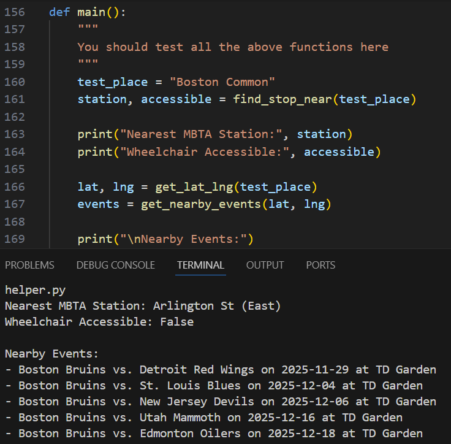
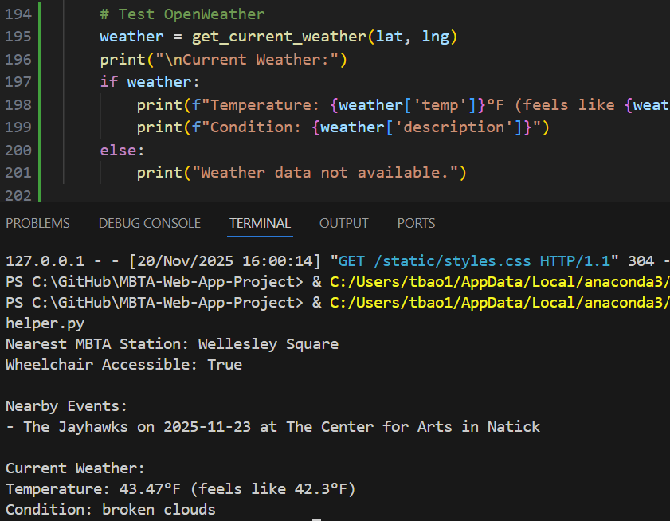
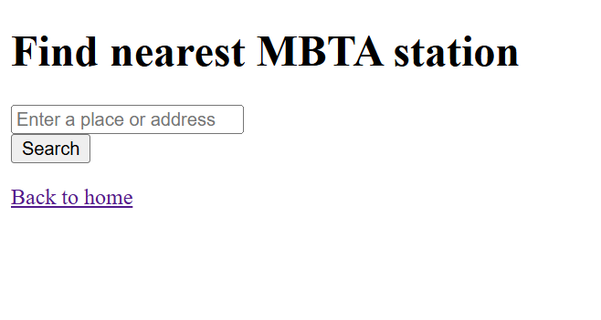
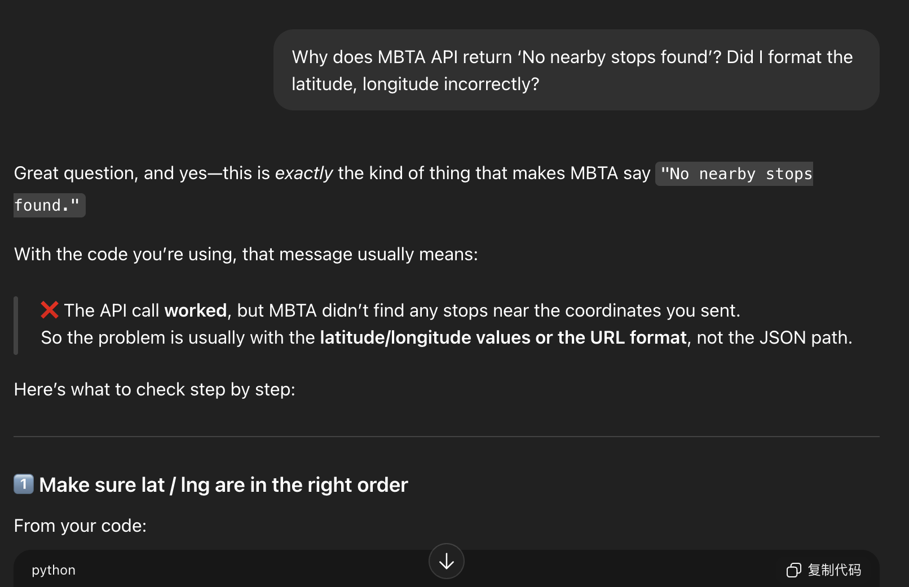
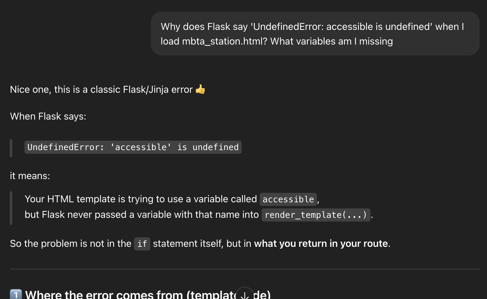
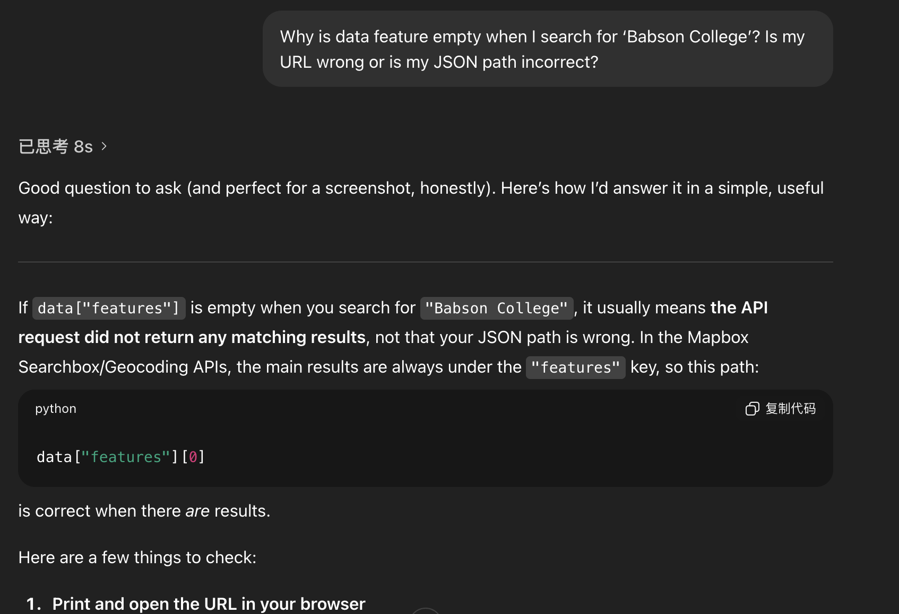

# MBTA-Web-App-Project

This is the base repository for Web App project. Please read the [instructions](instructions.md) for details.

Program by Tauria and Grace.

## Project Overview 

Our project is a Flask web app that lets the user input a place name and returns the nearest MBTA station. We used the Mapbox API to find the location’s coordinates, and the MBTA API to find the closest stop and whether it is wheelchair accessible.  

In addition to the above basic functions, we also added a few “Wow!” features. Our program displays real-time weather information using the OpenWeatherMap API and nearby events using the Ticketmaster API. Furthermore, to make the website easier to use, we used CSS to customize the cleaner layout. 

## Reflection 

### Development Process 

One thing that went well in our project was testing our code often. Instead of waiting until the end, we checked each function as we built it, which helped us catch mistakes early. This was especially useful when working with the Mapbox and MBTA functions, because we could immediately see whether the output made sense. 

The most challenging part was managing the APIs and figuring out how to store and use the values they returned. Some of the responses were confusing, and we had to spend time figuring out what information we needed and how to access them. It was also hard to keep track of which values needed to be passed into different parts of the program. 

For problem-solving, we would work backwards from the error and try to trace the problem by printing values along the way. If that did not work, we used ChatGPT to understand the error messages and debug our code. 

If we were to do this project again, we would try to plan the order of tasks and what features we wanted to implement more clearly before starting. This would give us a more streamlined process and decrease the amount of time we spent going back and debugging old code after we added more features. 

## Teamwork & Work Distribution 

At the beginning of the project, we realized that our schedules did not align, so we decided to primarily work independently. First, we focused on the basic app, and we agreed that the person who was available earlier would work on the APIs, and the second person would use that code to build the Flask app when they were available. 

As such, Tauria worked with the Mapbox and MBTA APIs, including getting the data and completing the helper file. Grace worked on the web app, setting up the Flask routes and building the HTML templates. 

When we moved on to the “Wow!” features, we chose to implement weather data, Ticketmaster events, and redesign our website using CSS. Grace was responsible for the weather feature, and Tauria handled the Ticketmaster events and the CSS. 

Even though our roles were clear and we didn’t have any communication issues, our workflow wasn’t very organized. Since we did not work linearly, we often had to go back and change each other’s code when working on the “Wow!” features. For example, adding CSS meant Tauria had to change the templates that Grace wrote, and adding weather meant Grace had to edit some of Tauria’s earlier API code. This took extra time because we had to understand the sections the other person wrote. 

However, one positive result was that we kept checking each other’s work and made sure there were no mistakes. Next time, we plan to work on the last section, where we combine our individual work, together. This way, we can assemble the final deliverable as a team, and both understand how everything fits together. 

## Learning & Use of AI Tools 

Through this project, we learned a lot about how APIs and JSON data work in real applications. Before this, we had never used multiple APIs at the same time, so working with Mapbox, MBTA, OpenWeatherMap, and Ticketmaster helped us understand how different services format their data and why documentation matters. To understand what each API returned, we printed the JSON responses and tested small pieces of code in main(). 

Also, working on the Flask part of the project helped us understand how a backend web app functions. Before this assignment, we mostly used Python to print values in the terminal, but building routes like /mbta, handling POST forms, and rendering HTML templates showed us how a real website sends and receives information. We learned the difference between GET and POST requests, how request.form works, and how to pass variables from Python into HTML. 

One of our biggest learning experiences was how to debug code. Many of our errors came from small issues, like missing URL parameters, choosing the wrong JSON field, formatting the API request, and forgetting to save the code before running it. Testing one function at a time and checking our values step by step helped us stay organized and solve problems more quickly. 

In terms of AI use, we mainly used ChatGPT to understand API errors, create HTML and CSS templates, and troubleshoot bugs. AI was helpful for explaining new libraries and giving us ideas when we were stuck. However, we also learned that AI has limitations. Sometimes the suggestions didn’t match our file structure or used tools we were not supposed to use in this class, so we had to manually check and adjust the output. 

If we had known earlier how important it is to test each API individually before connecting everything to Flask, we would have saved a lot of time. Overall, AI helped us learn faster, but the debugging process helped us develop a deeper understanding. Below are screenshots of our process, including API testing, early Flask form outputs, and our chat history with ChatGPT.

#### Terminal Testing

#### Early Flask Form

#### ChatGPT Debugging

